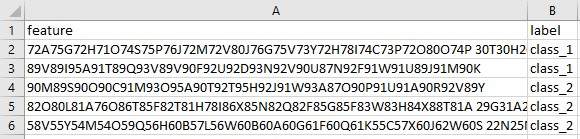
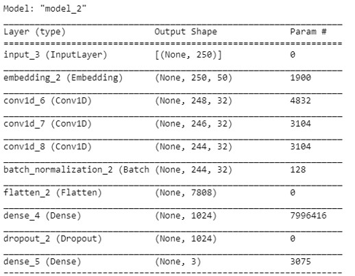
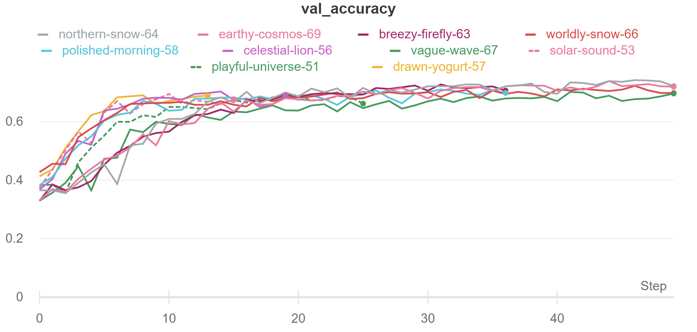
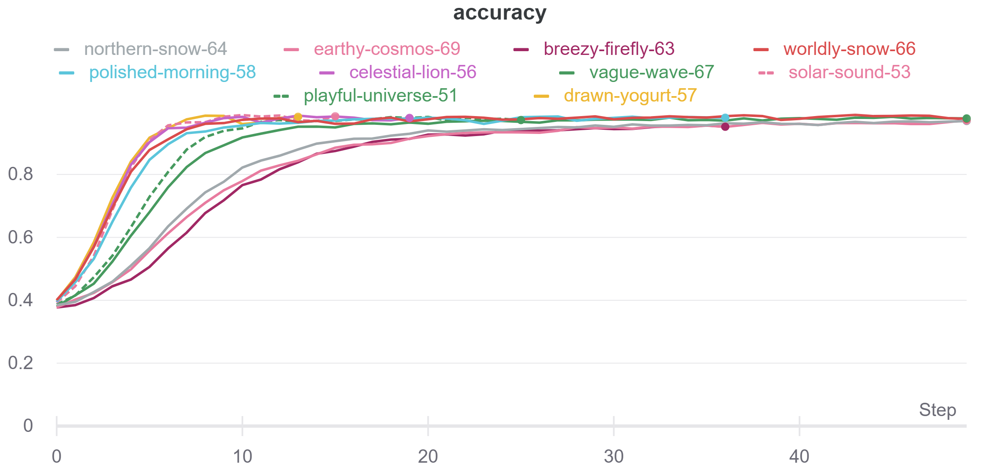
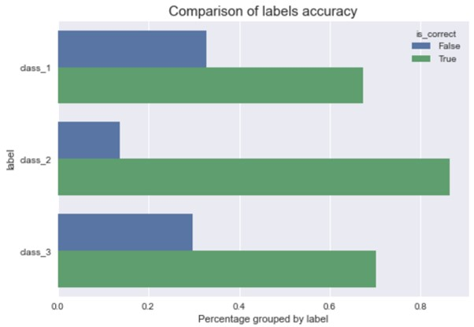
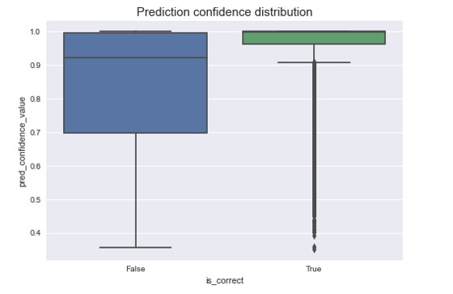

# Predicting on encrypted text

This project aims to train a deep learning text classification model that can predict on encrypted text. Here is a sample of the data used:



The label column has been encoded to mask the actual meaning before this project is pushed to github.

## Table of contents

1. [Installation](#installation)
1. [Running file](#running-file)
1. [Config](#config)
1. [Testing](#testing)
1. [Best Results](#best-results)
1. [Approach](#approach)
1. [Model Training Methodology](#model-training-methodology)
1. [Error Analysis](#error-analysis)

### Installation

To run the source code, install the following dependencies in a conda environment. This will create the exact same python environment as what the code was tested on, including the python version.

```
conda env create -f conda.yml
```

If u are not running on a conda environment, execute the following

```
pip install -r requirements.txt
```

Note that this source code was tested on python 3.8.10. If you are using a different python version, there might be some discrepancies in the output.

### Running file

After specifying the config in `config.json` and adding the `.h5` model weights, you can execute the following to predict on the test set and save a prediction output in the output path specified in the config file.

```
python main.py
```

### Config

The model architecture and the path of the data and trained weights can be configured in `config.json`

### Testing

To test the source code, execute the following at root directory:

```
pytest
```

### Best Results

The best result was achieved with a 1D-CNN model with the following metrics:

- Accuracy on validation set: 74.2%
- Accuracy on training set: 99%

`train.csv` was separated into 75-25 train-val split before training the model.

Given the limited time for this project, the best model validation accuracy I got was 74.2% with the following architecture.


The model has clearly overfitted but due to the lack of time, I am unable to continue tuning the hyperparameters to reduce the overfitting.

### Approach

This describes the approach I took for this project:

1. Perform exploratory data analysis in `eda.ipynb`
1. Basic experimentation of models in Google Colab
1. Build datapipeline and model classes in `src` folder for ease of reusing and configuring of models
1. Create test scripts to ensure that the classes in `src` folder are working as expected
1. Run multiple experiments on Google Colab and track experiments with Weights and Biases (WandB). The experiments can be found in `experiments.ipynb`
1. Iteratively tune hyperparameters by referring to the metrics logged on WandB
1. Download best model weights from WandB and save in `model_weights` folder
1. Specify best model config in `config.json`
1. Run `main.py` to obtain predicted test data
1. Perform error analysis of the best model in `error_analysis.ipynb`

### Model training methodology

#### Converting text to numbers

My initial thought upon receiving the data was to find a way to decrypt the encrypted text into words so that I can treat this a typical text classification problem and utilise pretrained model to create the model. However, after some thinking, I realised that it might be impossible to decrypt an encrypted text unless I have the secret key.

The next step was to think of a way to convert the encrypted text to tensors so that it can be fed into the deep learning model. I have considered the following:

1. Bag of words
1. N-gram
1. Word embeddings
1. Rule based encoding
1. Character embeddings

Bag of words and n-gram are the usual ways to convert text into numbers for classical machine learning models but they are too sparse (too many 0s) so they are not good with deep learning models. Word embedding is the usual way of converting text into numbers for deep learning problem but there isn't a proper way to define words since the data contains just chunks of encrypted text. I was also considering of using very rudimentary rule based encoding method to create features out of the encrypted text based on the exploratory data analysis but I thought it did not make sense for a human to figure out the rules of an encrypted text. A machine will be better at picking up the 'original word information' from the encrypted text. Therefore, using character embeddings seem the most feasible given that the same characters are repeated throughout the text so they make good embedding.

#### Model architecture

The model architectures I have considered using are:

1. 1D Convolutional layers
1. RNN based layers
1. Attention layers.

Due to the limited time available, I decided to experiment with 2 types of models: 1D Convolutional models and BiLSTM models. BiLSTM layer is chosen out of the different RNN layers so that it can learn the information better if the encryption is done in reverse direction. Attention layer is more tedious so I decided not to experiment with it given the limited time.

#### Tuning strategy

Before tuning the models, I wanted to get a baseline performance so I know how good the trained model is. The baseline model is used as the percentage of the most frequently occuring class, which was 35.9%, percentage of class_1.

I first tried configuring basic 1D CNN model and biLSTM model architecture to experiment if the following architecture works with the character embeddings. After tuning some of the basic configuration, I realised that the biLSTM model was not learning the train data well as the train loss was decreasing too slowly and the validation accuracy was not increasing after trying with several parameters. Hence, I decided to focus on 1D CNN, which was showing promising results.

With single 1D CNN layer and a single dense layer, I was getting around 50~% validation accuracy and 90+% accuracy on train set. There is clear overfitting in the model. To solve this, I added dropout and batch normalisation to reduce the overfitting, which helped to a small extent but I was still getting 90+% accuracy on training set. I also tried to reduce model complexity by reducing the number of units/ filters in the dense layer and convolutional layers as well as the embedding dimensions. However, all this reduces the validation accuracy further.

Another important hyperparameter i was tuning was the kernel size of the 1D CNN layer and the maxpooling. The kernel size of the 1D CNN was important because using the right kernel size as similar to how the encryption works will ensure that the model can learn the original text information. After tuning, I arrived at the conclusion that 3/5 kernel size was optimal. For maxpooling, after experimenting, it seems like not using it results in better performance. This is not surprising because maxpooling the layers will result in some loss of information.

Out of curiousity, I also added more convolutional layers and more units of dense layers and surprisingly model performance actually increased even though it was already overfitting.

The images below show the validation set accuracy and train set accuracy tracked on Weights and Biases:




#### Error Analysis

After obtaining the best model weights, I ran an error analysis on the validation set, which can be found in `error_analysis.ipynb` to analyse the wrong predictions.



The model is able to most accurately predict class_2 label at 86% accuracy. class_1 and class_2 do not fare as well as class_2 label, where the accuracy is around 70%.



In terms of prediction confidence value, those with the correct prediction generally have much higher confidence value than those that were wrongly predicted on average, which shows that the model confidence value is generally quite reliable.

Refer to `error_analysis.ipynb` for more detailed analysis.
